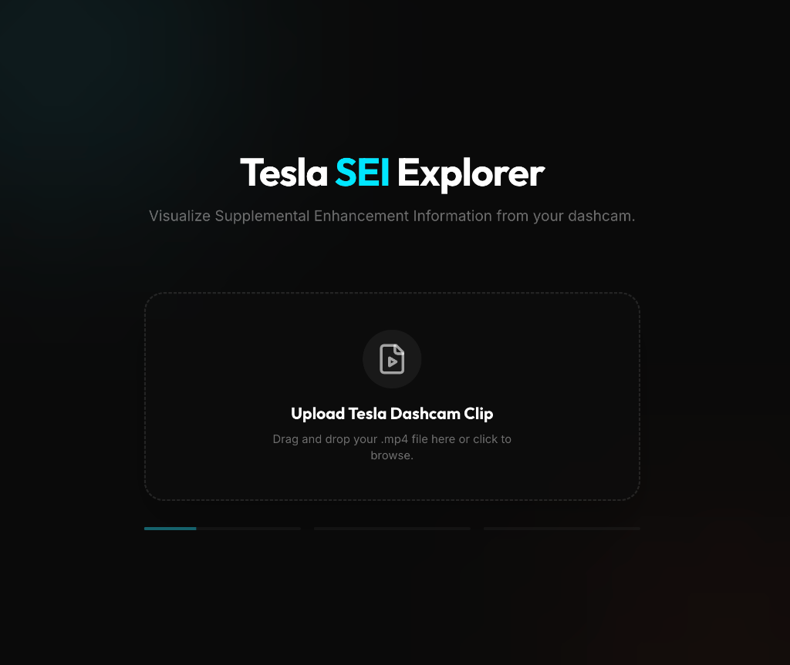

# Tesla SEI Visualizer 🏎️⚡

A high-performance, client-side web application for visualizing and exporting Tesla dashcam telemetry.

<<<<<<< HEAD
=======
**Try it out now: [https://carter437.github.io/tesla-sei/](https://carter437.github.io/tesla-sei/)**

[](https://carter437.github.io/tesla-sei/)


>>>>>>> develop
## 🌟 Overview

The **Tesla SEI Visualizer** allows Tesla owners to extract hidden "SEI" (Supplemental Enhancement Information) metadata from their dashcam or Sentry Mode footage. This metadata contains rich telemetry data including speed, pedal positions, steering angle, G-forces, and GPS coordinates.

<<<<<<< HEAD
This tool provides a real-time dashboard for viewing this data alongside your video and, most importantly, a **Video Export Engine** that "burns" these telemetry overlays directly into a new shareable MP4 file—all entirely within your browser.
=======
This tool provides a real-time dashboard for viewing this data alongside your video. 

The standout feature is the **"Export with Overlays"** button. With a single click, the app spins up a high-performance background process that:
-   **Synchronizes** the hidden telemetry with every video frame.
-   **Renders** the dynamic gauges (G-Ball, Speed, Pedals) directly onto the video.
-   **Encodes** a new, shareable MP4 file—all right in your browser without uploading a single byte to a server. 

Whether you're sharing a track day clip or verifying a Sentry Mode incident, you get a professional-looking video ready for social media in seconds.

## 🕹️ UI Components

The visualizer features a high-fidelity dashboard designed to match the Tesla aesthetic:

-   ⚡ **Speedometer**: A central readout showing velocity in MPH, flanked by active **Turn Signal** indicators (◀/▶) that glow green when blinking.
-   📉 **G-Force Ball**: Visualizes lateral and longitudinal acceleration. It features numerical X, Y, and Z readouts with dynamic color-coding (green for positive, red for negative) to track cornering and braking forces.
-   🎡 **Steering Wheel**: Rotates in real-time based on the actual steering rack angle. The icon glows **Tesla Blue** and displays status labels (TACC, Autosteer, FSD) when Autopilot systems are active.
-   🧭 **Compass Tape**: A sliding horizontal tape showing the vehicle's heading with cardinal directions and a precise degree readout.
-   🦶 **Pedal Telemetry**: 
    -   **Brake**: A pedal icon that glows red when physical braking is applied.
    -   **Accelerator**: A vertical gauge that fills with a blue gradient based on the percentage of pedal travel.
-   📍 **GPS Privacy Pill**: Displays real-time Latitude and Longitude. This component can be toggled off via the "Eye" icon in the UI to exclude it from being burned into the video during export.
>>>>>>> develop

## 🎞️ The "Why"

Tesla dashcams record more than just video; they embed real-time vehicle state data into the video stream. However, this data is invisible to standard video players. 

The goal of this project is to:
1.  **Visualize Performance**: See exactly how much braking or acceleration was applied during a specific moment.
2.  **Verify Incidents**: Provide clear, undeniable telemetry overlays for insurance or safety reviews.
3.  **Shareable Clips**: Create high-quality videos with easy to read gauges (G-Ball, Compass, Steering Wheel) that can be shared on social media or with the community.

## 🛠️ Technical Prowess

This application is built with a "Privacy First" philosophy—**zero data ever leaves your computer**. All processing is done locally via modern web APIs.

### 1. Metadata Extraction (SEI Parsing)
Tesla stores telemetry in H.264 SEI NAL units. We use `mp4box.js` to demux the video stream and a custom parser to extract and decode the binary packets into a structured TypeScript format.

### 2. High-Fidelity Rendering (`telemetryRenderer.ts`)
The dashboard gauges are rendered using a custom-built, **resolution-independent Canvas API** engine. 
- **Dynamic Scaling**: Guarantees that overlays look identical whether you are exporting at 720p, 1080p, or 4K.
- **Micro-Animations**: Features a kinetic G-Force trail, smooth compass transitions, and real-time steering wheel rotation.
- **Tesla Esthetics**: Colors and layouts are designed to feel like an extension of the Tesla UI.

### 3. Client-Side Video Export Engine
The "Export with Overlays" feature uses a sophisticated multi-stage pipeline running in a **Web Worker**:
- **Decoding**: `WebCodecs` (`VideoDecoder`) decodes raw H.264 frames.
- **Compositing**: `OffscreenCanvas` layers the telemetry gauges over each frame with sub-frame interpolation for smooth gauge movement.
- **Encoding**: `WebCodecs` (`VideoEncoder`) re-encodes the composited frames into a new H.264 stream.
- **Muxing**: `mp4-muxer` packages the encoded chunks into a valid, downloadable MP4 container.

## 🚀 Features

-   📍 **GPS Toggle**: Show or hide coordinates for privacy before exporting.
-   🎡 **Steering & Autopilot**: Visualizes steering angle and Autopilot states (TACC, Autosteer, FSD).
-   📉 **G-Force Ball**: 2D accelerometer visualization with a persistent kinetic trail.
-   🦶 **Pedal Telemetry**: Accurate visual representation of Brake and Accelerator application.
-   🧭 **Dynamic Compass**: Real-time heading with cardinal direction tracking.

## 🌐 Deployment (GitHub Pages)

This project is configured for easy hosting on GitHub Pages.

1.  **GitHub Actions**: A automated workflow (`.github/workflows/deploy.yml`) is included. It will automatically build and deploy the app every time you push to the `master` branch.
2.  **Repository Settings**:
    -   Go to your GitHub repository **Settings** > **Pages**.
    -   Under **Build and deployment** > **Source**, select **GitHub Actions**.
    -   The next time you push code, your site will be live at `https://<username>.github.io/<repo-name>/`.
3.  **Relative Paths**: The project is configured with `base: './'` in `vite.config.ts`, meaning you can also just run `npm run build` and open the `dist/index.html` file locally or upload it to any static host.

## 🛠️ Development

### Prerequisites
-   Node.js (v18+)
-   NPM or Yarn

### Setup
```bash
# Install dependencies
npm install

# Start dev server
npm run dev

# Run tests
npm test
```

## 📜 License
MIT
